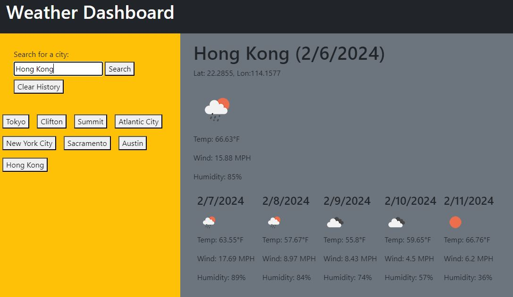

# 06 Server-Side APIs: Weather Dashboard Assignment Completion

## Objective

To create a weather dashboard app that allows users to search the weather conditions of the current day and the next 5 days in a specified city using the OpenWeather API

## User Story

```
AS A traveler
I WANT to see the weather outlook for multiple cities
SO THAT I can plan a trip accordingly
```

## Acceptance Criteria

```
GIVEN a weather dashboard with form inputs
WHEN I search for a city
THEN I am presented with current and future conditions for that city and that city is added to the search history
WHEN I view current weather conditions for that city
THEN I am presented with the city name, the date, an icon representation of weather conditions, the temperature, the humidity, and the wind speed
WHEN I view future weather conditions for that city
THEN I am presented with a 5-day forecast that displays the date, an icon representation of weather conditions, the temperature, the wind speed, and the humidity
WHEN I click on a city in the search history
THEN I am again presented with current and future conditions for that city
```

## URLs and Images

The following link is the student's URL to the completed assignment:
(https://ryanmoises5.github.io/Weather-Dashboard-RMwk6/)

The following link is the Github repository where the associated files are located:
(https://github.com/RyanMoises5/Weather-Dashboard-RMwk6)



---

Student: Ryan Moises